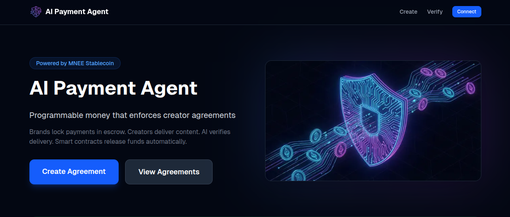

# AI Payment Agent for Creator Economy

> AI-powered proof-to-pay for trustless creator payments using MNEE stablecoin.

## Problem

Creator–brand payments frequently fail due to disputes:
- Brands claim deliverables were not met
- Creators claim content was delivered
- Payments are delayed, canceled, or resolved manually

## Solution

An autonomous AI agent that verifies creator deliverables and triggers MNEE payments automatically.

1. **Brand** locks MNEE in escrow + defines campaign rules
2. **Creator** delivers content (tweets)
3. **AI Agent** verifies delivery against rules using GPT-4
4. **Smart Contract** releases funds automatically

✅ No trust required  
✅ No manual approvals  
✅ No intermediaries

## Why MNEE

MNEE is not just a payment rail — it's **programmable money**:
- USD-backed stability
- On-chain settlement
- Condition-based release
- Global, permissionless payments

**This project would not work with traditional payment systems.**

## Demo

[Video Link] | [Live Demo]



## Architecture

```
┌─────────────┐     ┌─────────────┐     ┌─────────────┐
│   Next.js   │────▶│  AI Agent   │────▶│   OpenAI    │
│   Frontend  │     │   (API)     │     │   GPT-4     │
└─────────────┘     └─────────────┘     └─────────────┘
       │                   │
       ▼                   ▼
┌─────────────┐     ┌─────────────┐
│  Twitter    │     │  Ethereum   │
│  API/Input  │     │  Contract   │
└─────────────┘     └─────────────┘
                          │
                          ▼
                   ┌─────────────┐
                   │    MNEE     │
                   │  Stablecoin │
                   └─────────────┘
```

## Tech Stack

- **Frontend:** Next.js 14, TypeScript, Tailwind CSS
- **Wallet:** wagmi, viem
- **AI:** OpenAI GPT-4
- **Blockchain:** Ethereum, Solidity
- **Stablecoin:** MNEE (0x8ccedbAe4916b79da7F3F612EfB2EB93A2bFB6cF)

## Quickstart

```bash
# Install dependencies
cd app && pnpm install

# Set environment variables
cp .env.example .env.local
# Add your OPENAI_API_KEY and NEXT_PUBLIC_ESCROW_ADDRESS

# Run development server
pnpm dev
```

## Smart Contract

```bash
cd contracts
pnpm install
npx hardhat compile

# Deploy to Sepolia
npx hardhat run scripts/deploy.ts --network sepolia
```

## How It Works

1. **Create Agreement:** Brand connects wallet, enters creator address, MNEE amount, and campaign rules (hashtags, mentions)
2. **Lock Funds:** Brand approves MNEE and creates agreement - funds locked in escrow
3. **Deliver Content:** Creator posts tweet with required hashtags/mentions
4. **AI Verification:** System fetches tweet, GPT-4 verifies against rules
5. **Auto Release:** If verified, proof submitted on-chain, funds released to creator

## Roadmap

**Next 2 weeks:**
- Multi-platform support (Instagram, YouTube)
- Oracle decentralization
- Dispute arbitration system

**Next 2 months:**
- SDK for easy integration
- Mobile app
- Multi-chain deployment

## Team

Built by Levent for MNEE Hackathon 2026

## License

MIT
